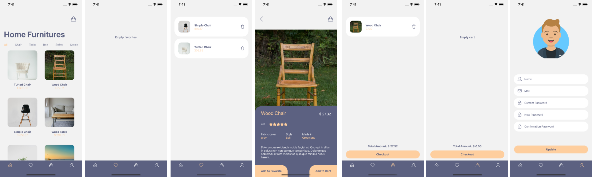

<h1 align="center">
    
</h1>

  <a href="#rocket-tecnologias">Tecnologias</a>&nbsp;&nbsp;&nbsp;|&nbsp;&nbsp;&nbsp;
  <a href="#-projeto">Projeto</a>&nbsp;&nbsp;&nbsp;|&nbsp;&nbsp;&nbsp;
  <a href="#-como-excutar">Como excutar</a>

 

  

## :rocket: Tecnologias

Esse projeto foi desenvolvido com a finalidade apenas para estudos com as seguintes tecnologias:

- [React Native](https://facebook.github.io/react-native/)
- [Expo](https://expo.io/)

## 💻 Projeto

O Show Room é um projeto que visa conectar pessoas que desejam adquirir um movél para sua residência

## 🤔 Como excutar

- Faça o clone ou download do projeto;
- Acesse a pasta raiz do projeto e execute: `npm install`;
- Em seguida será necessário executar: `npm start` para rodar o projeto;

Feito com ♥ e ☕ by Lucas Krul 